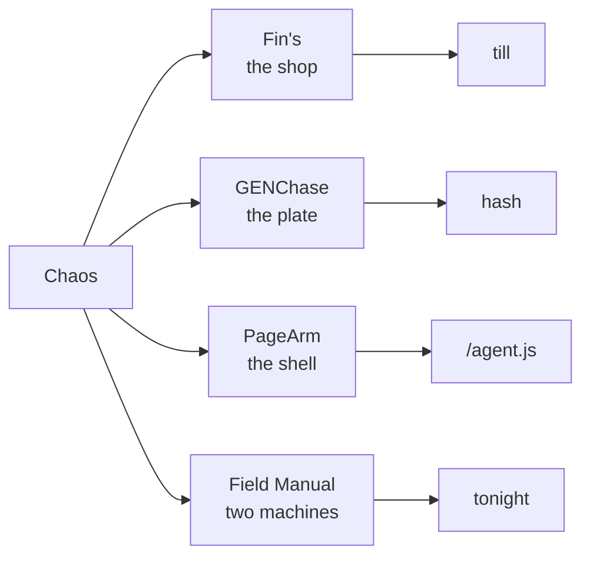

# Chaos

```
      |\_/|
      / o o \      shops. plates.
     (   "   )     agents. machines.
      \  ~  /      the till, then the hash.
     /'-----'\
    /  chaos  \
```


```
what leaves the desk
────────────────────
  shop     ████████████████   Fin's
  plate    ███████████████    GENChase
  agent    ████████████       PageArm
  manual   ██████████         field book
```



---

## On the bench

<table>
<tr>
<td width="50%" valign="top">
<a href="https://github.com/SharpMeow/Fins"></a>
<p><strong>Fin's.</strong> A harbor aquarium shop you keep. The floor floods. The baker remembers. Year 1000 is not the end of the record. Public. BSL 1.1.</p>
</td>
<td width="50%" valign="top">
<a href="https://github.com/SharpMeow/GENChase"></a>
<p><strong>GENChase.</strong> Generative art from real simulations. A seed reprints. A hash is the recipe. The images are yours. The source is not.</p>
</td>
</tr>
<tr>
<td width="50%" valign="top">
<a href="https://github.com/SharpMeow/pagearm"></a>
<p><strong>PageArm.</strong> Load unpacked once. After that the agent is a URL. Hash changes, Chrome evals. Hash same, it just arms. The toolbar says <code>P</code>.</p>
</td>
<td width="50%" valign="top">
<a href="https://github.com/SharpMeow/music-field-manual"></a>
<p><strong>Music Field Manual.</strong> MPC XL and a Jackson Soloist. A loop tonight. Then the book. Hear the chord. Tick the step.</p>
</td>
</tr>
</table>

```
            year
   2026 ──────────────────────── 2030
        ■■■■■■■■■■■ BSL
                            ■ Apache / GPL
        change date is a promise, not a vibe
```

No store listings. No accounts. No phone-home.

Built by Chaos. Meow.
