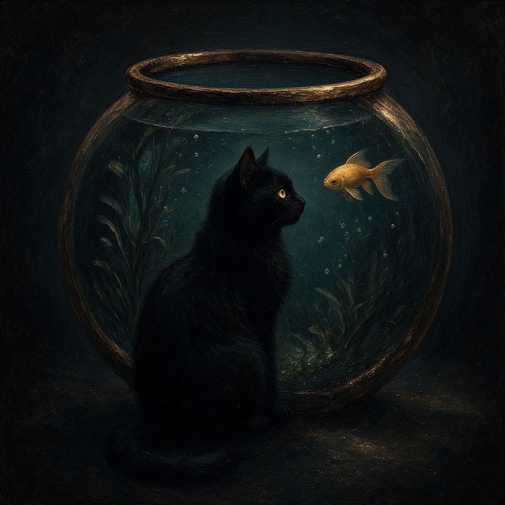
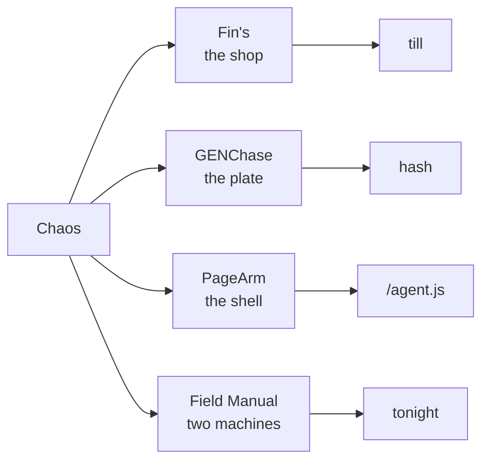
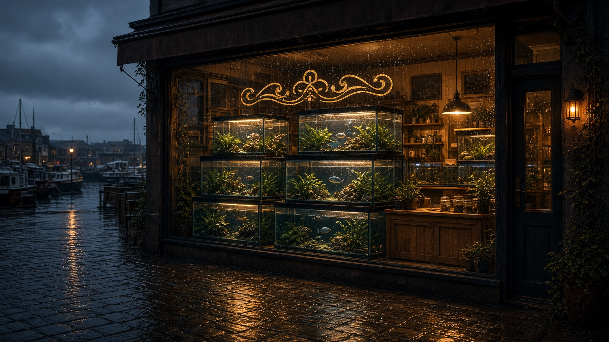
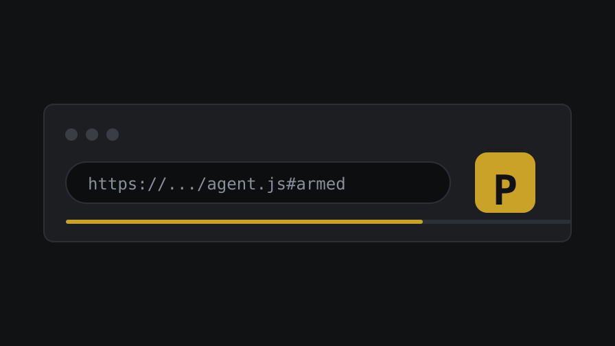
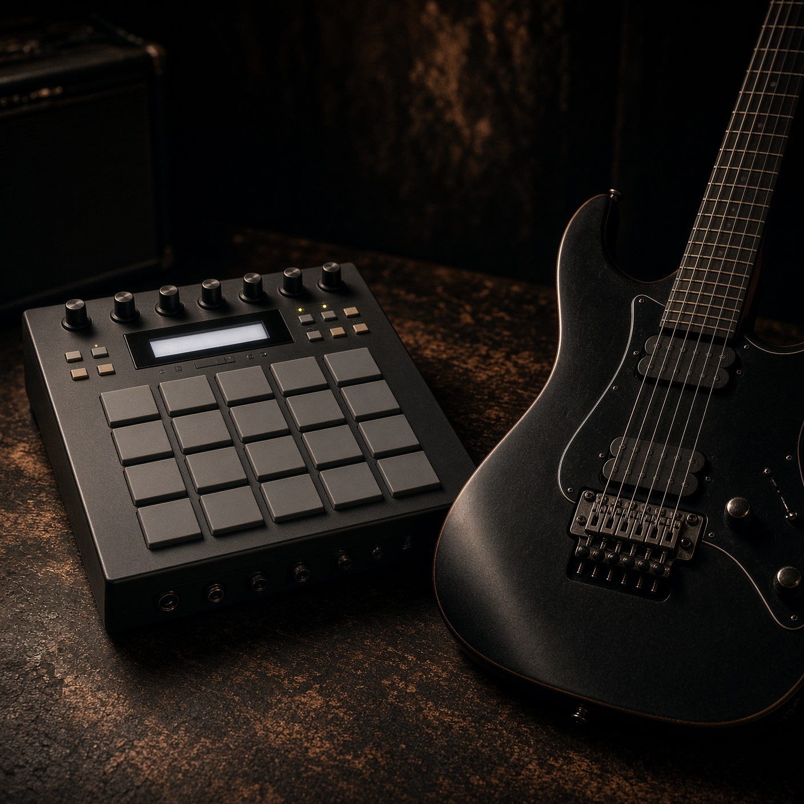

# Chaos

```
      |\_/|
      / o o \      shops. plates.
     (   "   )     agents. machines.
      \  ~  /      I build things, then I leave them running.
     /'-----'\
    /  chaos  \
```



Hey. I'm Chaos. I make small worlds that keep going.

```
what leaves the desk
────────────────────
  shop     ████████████████   Fin's
  plate    ███████████████    GENChase
  agent    ████████████       PageArm
  manual   ██████████         field book
```



---

## On the bench

<table>
<tr>
<td width="50%" valign="top">
<a href="https://github.com/SharpMeow/Fins"></a>
<p><strong>Fin's.</strong> A harbor aquarium shop you actually keep. The floor floods, the baker remembers your face, and year 1000 is just another page in the book. Public. BSL 1.1.</p>
</td>
<td width="50%" valign="top">
<a href="https://github.com/SharpMeow/GENChase"></a>
<p><strong>GENChase.</strong> Pictures grown from real simulations, not prompts. Same seed, same plate. The hash is the recipe. You can keep the images. The source stays mine for now.</p>
</td>
</tr>
<tr>
<td width="50%" valign="top">
<a href="https://github.com/SharpMeow/pagearm"></a>
<p><strong>PageArm.</strong> Load it unpacked once. After that the agent is just a URL. Hash changes, the browser evals. Hash stays the same, it just arms. The toolbar button is <code>P</code>.</p>
</td>
<td width="50%" valign="top">
<a href="https://github.com/SharpMeow/music-field-manual"></a>
<p><strong>Music Field Manual.</strong> An Akai MPC XL and a Jackson Soloist sitting on the same desk. Make a loop tonight. Learn the machines tomorrow. Hear the chord. Tick the step.</p>
</td>
</tr>
</table>

```
            year
   2026 ──────────────────────── 2030
        ■■■■■■■■■ BSL
                            ■ Apache / GPL
        the change date is a promise, not a vibe
```

I don't want your email. I don't want a login. If it needs a server to stay alive, I probably didn't ship it.

Built by Chaos. Meow.
